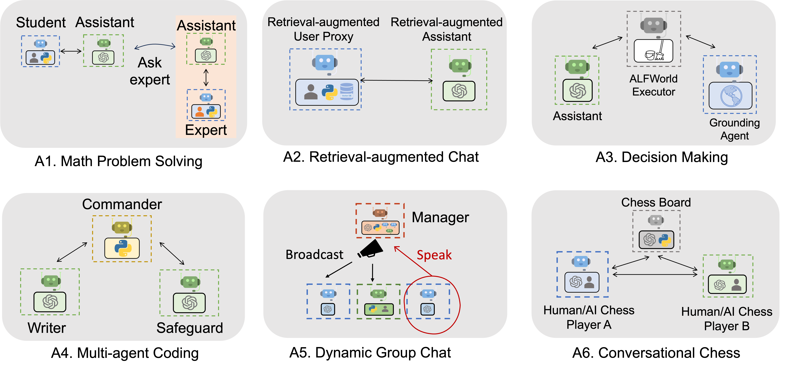

# 第一章：简介

## 概述

>*"The whole is greater than the sum of its parts."*
>
>— Aristotle

`AutoGen` 是一个多智能体对话框架，专为快速创建具有不同角色、个性和能力的多个代理而设计。通过这一框架，我们可以使用不同的 `AI` 智能体设计模式来实现复杂的 `AI` 应用。

`AutoGen` 提供了一个统一的多智能体对话框架，作为使用基础模型的高级抽象。它具有功能强大、可定制和可对话的代理，通过自动代理聊天集成 `LLMs` 、`tools` 和 `human` 。通过在多个智能体之间自动化地聊天，可以很容易地让他们自主或在人类反馈下集体执行任务，包括需要通过代码使用工具的任务。

该框架简化了复杂 `LLM` 工作流程的编排、自动化和优化。它最大限度地提高了模型的 `LLM` 性能并克服了它们的弱点，从而可以让开发者以最小的工作量构建基于多智能体对话的下一代 `AI` 应用。

下图显示了使用 `AutoGen` 构建的六个应用示例及其设计模式：

## 主要特点

##### 可扩展性与可组合性

`AutoGen` 具有高度的可扩展性和可组合性。我们可以通过自定义组件扩展简单的智能体，并创建组合这些智能体的工作流程，从而驱动更复杂的代理。这种设计确保了系统的模块化和易于维护。

##### 多智能体协作

在 `AutoGen` 中，智能体不仅可以模拟现实世界和抽象实体（如人类和算法），还能够简化复杂工作流程的实施。智能体之间的协作是该框架的核心，可以让我们实现诸如研究员、数据分析师、程序员和作家等多种角色之间的高效互动。

##### 社区支持

- `AutoGen` 由一个充满活力的研究人员和工程师的社区共同开发和维护。
- 社区融合了多智能体系统的最新研究成果，并已被应用于许多实际场景中，包括广告、`AI` 员工、博客写作、区块链、智能客服、网络安全、数据分析、辩论、教育、金融、游戏、法律咨询、研究、机器人、销售与营销、社会模拟、软件工程、软件安全、供应链管理、培训数据生成和 `YouTube` 服务等。

##### 智能体设计模式

`AutoGen` 提供了多种基本的智能体设计模式，包括多智能体协作、反思、工具使用、代码生成和规划等。这些设计模式可以作为构建模块，帮助你创建应用程序并解决非常复杂的任务。

##### 模块化与易于维护

通过模块化的实现方式，`AutoGen` 确保了系统的易于维护性。我们可以在智能体中自由开启或关闭每个组件，并根据具体应用的需求进行定制。

##### 角色分配与对话推进

在 `AutoGen` 中，智能体可以被分配特定的角色，并参与到对话或彼此聊天中。对话是智能体之间消息交换的序列，通过这些对话可以推进任务的进展。

## 组件驱动

智能体可以由以下组件驱动：

- 大语言模型（如 `GPT-4`）
- 代码执行器（如 `IPython` 内核）
- 人类输入
- 其他可定制的组件

> 内置的 `ConversableAgent` 支持语言模型、代码执行器、函数和工具执行器等组件，并保持人类参与的能力。对于开发者，可以通过 `registered_reply` 添加额外的组件到智能体中。

## 结论

`AutoGen` 是一个功能强大且易于使用的多智能体对话框架，其高度的可扩展性、可组合性和社区支持使其成为实现复杂 `AI` 应用的理想选择。无论是初学者还是高级用户，都可以通过 `AutoGen` 快速创建和管理智能体，进行大语言模型的应用开发，解决广泛存在的各种问题。
